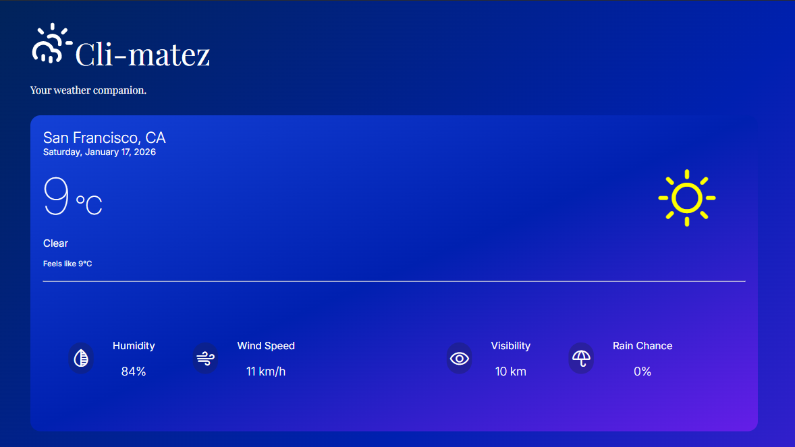

# 🌦️ Cli-matez - Your Weather Companion

**Cli-matez** adalah aplikasi cuaca berbasis web yang dirancang dengan antarmuka modern, responsif, dan elegan. Aplikasi ini menyajikan data cuaca real-time, prakiraan per jam, dan prediksi 7 hari ke depan menggunakan data akurat dari **Open-Meteo API** serta akses lokasi dari **BigDataCloud API**.



## 🚀 Live Demo
(https://cli-matez.netlify.app/)

---

## ✨ Fitur Utama (Key Features)

### 1. Real-Time Weather Data
* Menampilkan suhu saat ini, deskripsi cuaca (Cerah, Berawan, Hujan), dan lokasi.

### 2. Comprehensive Metrics
Menampilkan detail parameter cuaca penting:
* 💧 **Humidity:** Kelembaban udara real-time.
* 💨 **Wind Speed:** Kecepatan angin (dikonversi ke km/h).
* ☔ **Rain Chance:** Persentase peluang hujan (menggantikan data tekanan udara yang kurang relevan bagi pengguna umum).
* 👁️ **Visibility:** Jarak pandang (Static/Dummy untuk menjaga layout UI).

### 3. Hourly Forecast (24 Jam)
* Prakiraan cuaca per jam yang dapat digeser secara horizontal (*Horizontal Scroll*).
* Menggunakan data `hourly` untuk akurasi suhu dan kondisi cuaca jangka pendek.

### 4. 7-Day Forecast
* Prakiraan jangka panjang untuk satu minggu ke depan.

---

## 🎨 UI/UX Design Highlights

Proyek ini dibangun dengan pendekatan **Mobile-First** dan prinsip desain modern:

* **Responsive Layout:**
    * 📱 **Mobile:** Menggunakan *Stacking Layout* dengan *Horizontal Scroll Snap* untuk kartu prakiraan cuaca, memberikan pengalaman native app.
    * 💻 **Tablet/Desktop:** Menggunakan **CSS Flexbox & Grid** untuk menata ulang elemen menjadi layout multi-kolom yang luas dan informatif.
* **Glassmorphism Aesthetic:** Penggunaan gradasi warna biru gelap dan elemen semi-transparan memberikan kesan elegan dan premium.
* **Interactive Elements:** Efek *hover* pada kartu cuaca (khusus Desktop) dan tombol "Back to Top" yang muncul otomatis saat scroll.
* **Dynamic Icons:** Integrasi **Phosphor Icons** yang berubah secara dinamis sesuai kondisi cuaca (Cerah ☀️, Hujan 🌧️, Berawan ☁️).

---

## 🛠️ Teknologi yang Digunakan (Tech Stack)

* **Frontend:** HTML5, CSS3 (Custom Properties, Flexbox, Grid).
* **Logic:** Vanilla JavaScript (ES6+).
* **Data Fetching:** Fetch API, Async/Await, Promise.all (untuk memuat data harian dan per jam secara paralel).
* **API Provider:** [Open-Meteo API](https://open-meteo.com/) & [BigDataCloud API](https://api.bigdatacloud.net/).
* **Icons:** [Phosphor Icons](https://phosphoricons.com/).

---

## 🧠 Tantangan & Penyelesaian (Challenges & Solutions)

Selama pengembangan, beberapa tantangan teknis utama yang berhasil diselesaikan meliputi:

1.  **CSS Grid Alignment:**
    * *Masalah:* Pada daftar 7-hari, ikon cuaca tidak lurus vertikal karena perbedaan panjang teks nama hari (misal: "Wednesday" vs "Friday").
    * *Solusi:* Mengganti Flexbox dengan **CSS Grid** (`grid-template-columns: 1fr 1fr 1fr`) dan menggunakan `justify-self: center` untuk mengunci posisi ikon tepat di tengah.

2.  **Mobile Horizontal Scroll:**
    * *Masalah:* Kartu prakiraan cuaca per jam menumpuk ke bawah atau mengecil (gepeng) di layar HP.
    * *Solusi:* Menerapkan `flex-wrap: nowrap`, `overflow-x: auto`, dan `min-width` pada kartu agar bisa di-scroll ke samping dengan efek *snap*.

3.  **Data Accuracy (Hourly vs Daily):**
    * *Masalah:* Data *Humidity* sering muncul `undefined` saat menggunakan endpoint *Daily Forecast*.
    * *Solusi:* Mengalihkan sumber data "Saat Ini" menggunakan endpoint *Hourly Forecast* (`periods[0]`) yang menyediakan data real-time lebih lengkap.

---

## 📦 Cara Menjalankan (Installation)

1.  **Clone repositori:**
    ```bash
    git clone [https://github.com/hisyamuel/climatez-app.git](https://github.com/hisyamuel/climatez-app.git)
    ```
    
2.  **Buka Project:**
    Buka file `index.html` langsung di browser, atau gunakan ekstensi **Live Server** di VS Code.

---

## 🤝 Kontak & Author

Project ini dikembangkan oleh:

**Nur Amali Hisyam**
| *Mahasiswa Universitas Terbuka | Web Development Enthusiast*

* **Portfolio:** [nramlhsym.netlify.app](https://nramlhsym.netlify.app/)
* **GitHub:** [github.com/hisyamuel](https://github.com/hisyamuel) 
* **LinkedIn:** [linkedin.com/in/nuramalihisyam](https://linkedin.com/in/nuramalihisyam) 

---
*© 2026 Cli-matez. Created with passion & goon.*